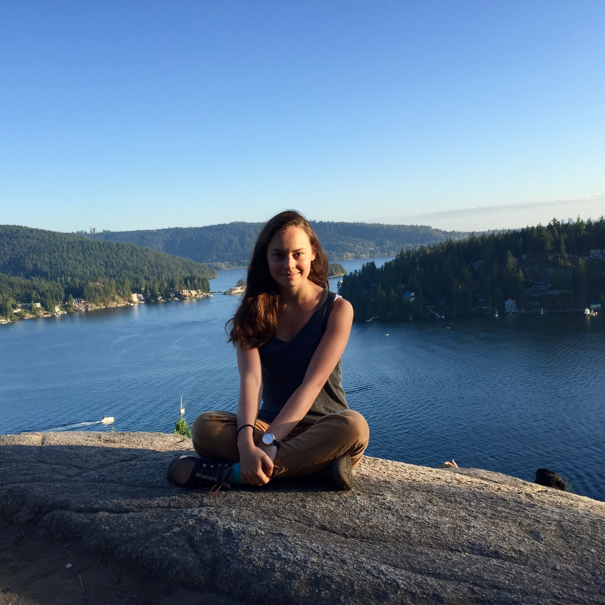

Hi there!

My name is Alison Pouplin, and I am a PhD student at the Technical University of Denmark ([DTU](https://www.compute.dtu.dk/english/research/research-sections/cogsys)) in the Department of Applied mathematics and Computer science. I am extremely lucky to be supervised by [Søren Hauberg](http://www2.compute.dtu.dk/~sohau/), [David Eklund](https://people.kth.se/~daek/), and [Carl Henrik Ek](http://carlhenrik.com/). In September 2021, I will be in Cambridge for a research stay !

My research consists in exploring the [Finslerian aspects of random geometry](https://www.compute.dtu.dk/english/phd/current-phd/phd-cogsys/alison-marie-sandrine-pouplin), and applying some ideas to improve machine learning models. In general, I am very exited about exploring the geometrical and topological aspects of generative models.

Prior to my current position, I spent two years developing machine learning algorithms to detect skin cancer.
<!-- I previously studied bioengineering, applied physics and photonics at the [Imperial College](https://www.imperial.ac.uk/) (London, UK), [ESPCI](https://www.espci.psl.eu/en/) (Paris, France) and [Institut d'Optique](https://www.institutoptique.fr/en) (Saclay, France). -->

<!-- May this PhD diary sparks you joy.  -->
Feel free to reach out, and chat about mathematics ! :)

<!-- {: align="center" width="512px" srcset="/assets/icons/icon.jpg"} -->
